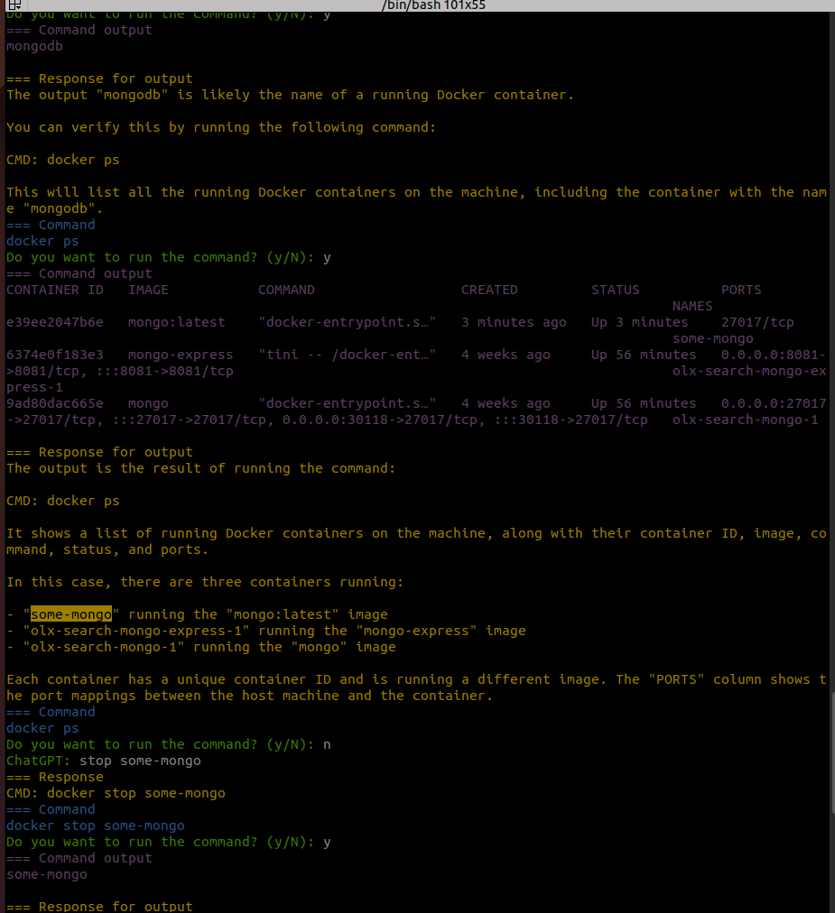

# Simple GPT Shell

The `gpt-shell.py` script is a robust Python command-line interface that harnesses the power of OpenAI's GPT models to offer insightful suggestions for shell commands. Whether you input a specific command or describe a task, the application will generate an appropriate command as interpreted by the selected GPT model.

The script communicates with the chosen GPT model through the OpenAI API and enhances user interaction. For the script to function, an API key, set as an environment variable, is a necessity.

Designed for terminal environment operation, this script provides a user-friendly system prompt for input. In addition to sending the output of the command to the terminal, the script also sends it to the OpenAI GPT chat, which can provide additional suggestions for further commands to execute. It shines in its ability to consolidate multi-step commands into a single-line command. In addition, it includes an analysis of the command's output performed by the GPT model, providing a comprehensive execution explanation along with the suggested command.

## Installation

1. Clone the repository to your local machine.
2. Install the required dependencies by running `pip install -r requirements.txt`.
3. Set your OpenAI API key as an environment variable `export OPENAI_API_KEY='your-api-key'`.

## Usage

1. Open a terminal and navigate to the directory where `gpt-shell.py` is located.
2. Run the script by typing `python gpt-shell.py` and pressing enter.
3. Follow the system prompt to input commands.
4. The script will provide a suggested command to execute based on the input.

## Contributing

Contributions are welcome! If you find a bug or have an idea for a new feature, please open an issue or submit a pull request.

## License

This project is licensed under the MIT License. See the [LICENSE](LICENSE) file for details.
