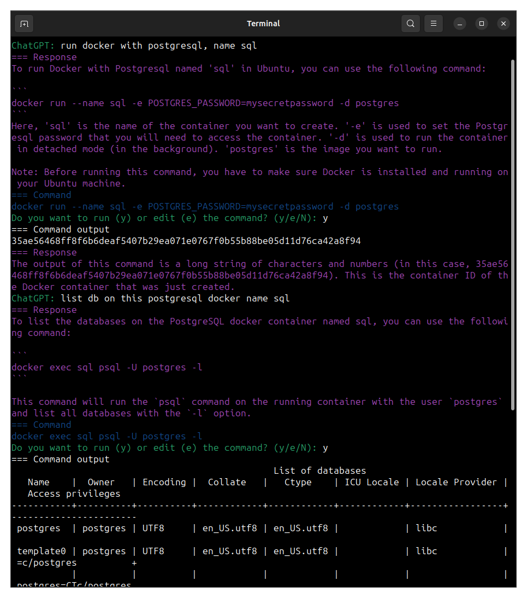

# Simple GPT Shell

The `gpt-shell.py` script is a Python command-line interface that uses OpenAI's GPT-3 API to provide suggested commands for Linux shell commands. The script prompts the user to input a command and then provides a suggested command to execute based on the input. The script uses the `revChatGPT.V3` module to interface with the GPT-3 API and requires an API key to be set as an environment variable. The script is designed to be run in a terminal and provides a system prompt for the user to input commands. If the suggested command requires multiple steps, the script will attempt to combine them together. The output of the command is analyzed by the GPT-3 model to provide a description of the suggested command.

## Installation

1. Clone the repository to your local machine.
2. Install the required dependencies by running `pip install -r requirements.txt`.
3. Set your OpenAI API key as an environment variable named `OPENAI_API_KEY`.

## Usage

1. Open a terminal and navigate to the directory where `gpt-shell.py` is located.
2. Run the script by typing `python gpt-shell.py` and pressing enter.
3. Follow the system prompt to input commands.
4. The script will provide a suggested command to execute based on the input.

## Contributing

Contributions are welcome! If you find a bug or have an idea for a new feature, please open an issue or submit a pull request.

## License

This project is licensed under the MIT License. See the [LICENSE](LICENSE) file for details.